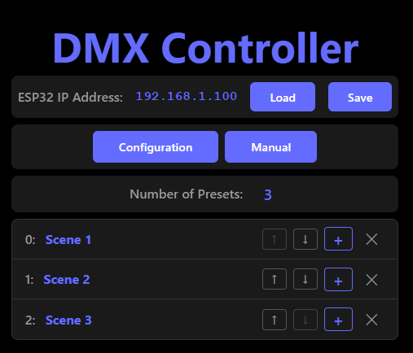
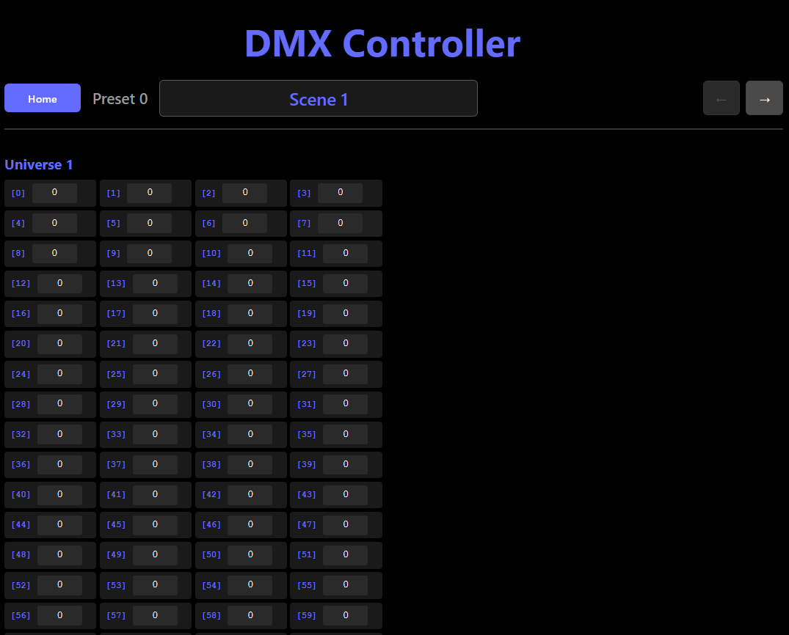

# User Manual

## Overview

This device is a DMX controller that allows you to manage up to 20 presets, each with a full DMX universe (512 channels). Configuration and management are performed via a user-friendly web interface. The enclosure is equipped with a display and a power barrel plug for the power adapter, a 3 pin DMX connector, and a 6.3mm jack plug for the foot switch.

---

## Presets

- **Up to 20 presets** can be stored and selected.
- Each preset can be configured for all 512 DMX channels (1 DMX universe).
- Presets are managed and edited through the web interface.

---

## Web Interface

The device hosts a website for configuration and control. Access the website by connecting to the device's network and entering its IP address in your browser.

### Main Navigation Buttons

At the top of the web interface, you will find several important buttons:

- **Load**: Loads the current configuration and presets from the device. Use this to refresh the interface with the latest data stored on the controller.
- **Save**: Saves any changes you have made to presets or configuration back to the device. Always click Save after making adjustments to ensure your changes are stored.
- **Configuration**: Opens the configuration page, where you can adjust system settings such as DMX transmission, foot switch behavior, OSC, and more.
- **Manual**: Opens this user manual directly in the web interface for quick reference and help.

### Managing Presets

The preset management area allows you to organize and edit your DMX presets directly from the web interface. Here are the main controls:

- **Index**: The number shown at the start of each preset row. This is the preset's position/order in the list.
- **Name**: Pressing on the name the navigation moves to a new screen to edit the preset's name and DMX channel values.
- **Arrow Down (↓)**: Moves the preset one position lower in the list, swapping with the preset below.
- **Arrow Up (↑)**: Moves the preset one position higher in the list, swapping with the preset above.
- **Plus (+) Button**: Adds a new preset to the list. The new preset will appear at the end or in the next available slot.
- **X Button**: Deletes the corresponding preset from the list. Use with caution—this action cannot be undone.

These controls make it easy to reorder, rename, add, or remove presets as needed for your show or installation.

### Editing a Preset

Clicking the Name of the preset shows the edit screen:

Below the edit preset image, you will find the following controls and fields:

- **Preset Number**: Clearly displayed at the top or in the header, indicating which preset you are currently editing.
- **Preset Name**: An editable field where you can assign or change the name of the current preset for easy identification.
- **DMX Values (1–512)**: A grid where you can set the value (0–255) for each of the 512 DMX channels in the preset. Adjust these values to define the lighting or device behavior for this preset.
- **Left Arrow (←)**: Navigate to the previous preset in the list. This allows you to quickly switch and edit other presets without returning to the main list.
- **Right Arrow (→)**: Navigate to the next preset in the list.

These controls make it easy to view, edit, and navigate between all your DMX presets directly from the web interface.

When selecting a value of one of the 512 DMX channels, you get to the a screen to edit the DMX value for that channel:

### Configuration Section

The website provides the following configuration options:

#### Presets

- **Maximum Number of Presets**: Set the maximum number of presets (20–50).
- **Blackout Preset Long Press Time**: Set the time (2000–5000 ms) required to activate the blackout preset with a long press while on preset 1.

#### Foot Switch

- **Polarity**: Choose between Normally Open and Normally Closed for the foot switch polarity.
- **Long Press Time**: Set the duration (in milliseconds) required for a long press action on the foot switch (range: 500–2000 ms).
- **Send Foot Switch State Changes through OSC**: Enable to send foot switch state changes as OSC messages. (Unused for now, but may be implemented in the future).

#### OSC (Open Sound Control) (Unused for now, but may be implemented in the future).

- **OSC Address (IP)**: Set the destination IP address for OSC messages.
- **OSC Receive Port**: Set the port to receive OSC messages (1–65535).
- **OSC Send Port**: Set the port to send OSC messages (1–65535).

---

## Enclosure and Connectors

### Front

- **Display**: Shows current status, preset, and other information.

### Back

- **Barrel Jack (Power)**: 5V, 1A input for powering the device.
- **6.3mm Jack Plug**: For connecting an external foot switch.
- **3-pin DMX Plug**: Standard DMX output connector for connecting to DMX lighting equipment.

---

## Quick Start

1. Connect power (5V, 1A) to the barrel jack. A boot sequence will start, and the display will show the status.
   An adapter with a 5V, 1A output is required. Ensure the adapter is compatible with your region's power standards.
2. Connect the DMX output to your lighting equipment using the 3-pin DMX connector.
3. Connect the foot switch to the 6.3mm jack plug.
4. Access the web interface to configure presets and settings.
5. Use the foot switch and web interface to operate the device.

---

---

## Foot Switch Usage

The foot switch provides hands-free control and special functions:

- **During power up:**
  - **Long press:** Initiates OTA (Over-The-Air) firmware update mode.
- **Normal operation:**
  - **Short press:** Selects the next preset.
  - **Long press:** Selects the previous preset.

To prevent accidental activation of the OTA update mode, the device will only enter this mode if the foot switch is held down for a long press during the boot sequence. If the foot switch is pressed after the device has fully booted, it will not trigger OTA mode.

### Blackout Preset

- **At startup:** The blackout preset is selected and the display shows `P---`.
- **When at preset 1:**
  - A long press will show `P0-1` (still transmitting P1).
  - Only when a long press of 5 seconds or more is performed, the blackout preset becomes active (display shows `P---`).
  - Any press (long or short) while in blackout will move to P1.

---

## Display Information

The 4-digit 7-segment display provides feedback and status. Below is a table of each display item and its 4-character representation:

| Function / Status        |      Displayed Text      |
| ------------------------ | :----------------------: |
| Preset number (e.g. 15)  |         `P  15`          |
| Blackout preset          |     `P0-1` or `P---`     |
| Booting                  |          `boot`          |
| Boot ready               |          `rEAd`          |
| OTA update in progress   |          `otAb`          |
| OTA finished (success)   |     `otAF` or `donE`     |
| OTA failed               |          `FAIL`          |
| DMX transmit error       |          `dEr `          |
| Artnet error             |          `AEr `          |
| No WiFi                  |          `noFi`          |
| WiFi connected           |          `ConF`          |
| NVRAM error              |          `nEr `          |
| Webserver error          |          `wEr `          |
| Webserver connected      |          `wCon`          |
| Number of presets loaded | `L  20` (for 20 presets) |
| Preset removed           |          `rEM `          |
| Preset added             |          `Add `          |
| Preset changed           |          `CHAn`          |
| Config changed           |          `CnFG`          |

> Note: Some messages are abbreviated to fit the 4-digit display. Characters are shown as they would appear on a 7-segment display.
