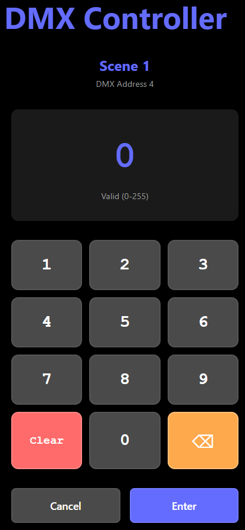

# User Manual

## Overview

This device is a DMX controller that allows you to manage up to 20 presets, each with a full DMX universe (512 channels). Configuration and management are performed via a user-friendly web interface. The enclosure is equipped with a display and a power barrel plug for the power adapter, a 3 pin DMX connector, and a 6.3mm jack plug for the foot switch.

## Presets

- **Up to 20 presets** can be stored and selected.
- Each preset can be configured for all 512 DMX channels (1 DMX universe).
- Presets are managed and edited through the web interface.

## Web Interface

The device hosts a website for configuration and control. Access the website by connecting to the device's network and entering its IP address in your browser.

**WARNING**: Do not show AND EDIT presets or configuration items simultaneously on multiple devices. This can lead to conflicts and data loss. Always ensure that only one user is editing presets or configuration at a time.

### Main Screen

At the top of the web interface, you will find the following controls:

- **DMX Controller**: The title of the web interface. Pressing this will return you to the main screen from any other page.
- **Version**: Displays the current firmware version of the device for reference.
- **ESP32 IP Address**: Shows the current IP address of the device, which you can use to access the web interface.
- **Load button**: Loads the current configuration and presets from the device. Use this to refresh the interface with the latest data stored on the controller.
- **Save button**: Saves any changes you have made to presets or configuration back to the device. Always click Save after making adjustments to ensure your changes are stored.
- **Blackout button**: Instantly sets all DMX channels to 0, effectively turning off all connected lights. Press again to restore the previous preset values. When the foot pedal is used to change presets, the blackout state is automatically cleared, and the new preset values are applied. The blackout option can be used before and after shows and in gig breaks, without having to disconnect the DMX output or power.
- **Configuration button**: Opens the configuration page, where you can adjust system settings such as DMX transmission, foot switch behavior, and more.
- **OTA button** : Opens the OTA (Over-The-Air) update page, allowing you to upload new firmware to the device directly from your computer without needing a physical connection.
- **Manual button**: Opens this user manual directly in the web interface for quick reference and help.

The preset management area allows you to organize and edit your DMX presets directly from the web interface. Here are the main controls:

- **Index**: The number shown at the start of each preset row. This is the preset's position/order in the list.
- **Name**: Pressing on the name the navigation moves to a new screen to edit the preset's name and DMX channel values.
- **Arrow Down (↓) button**: Moves the preset one position lower in the list, swapping with the preset below.
- **Arrow Up (↑) button**: Moves the preset one position higher in the list, swapping with the preset above.
- **Plus (+) button**: Adds a new preset to the list. The new preset will appear at the end or in the next available slot.
- **X button**: Deletes the corresponding preset from the list. Use with caution—this action cannot be undone.

These controls make it easy to reorder, rename, add, or remove presets as needed for your show or installation.

### Editing a Preset

Clicking the Name of the preset shows the edit screen:

Below the edit preset image, you will find the following controls and fields:

- **Preset Number**: Clearly displayed at the top or in the header, indicating which preset you are currently editing.
- **Preset Name**: An editable field where you can assign or change the name of the current preset for easy identification.
- **DMX Values (1–512)**: A grid where you can set the value (0–255) for each of the 512 DMX channels in the preset. Adjust these values to define the lighting or device behavior for this preset.
- **Left Arrow (←) button**: Navigate to the previous preset in the list. This allows you to quickly switch and edit other presets without returning to the main list.
- **Right Arrow (→) button**: Navigate to the next preset in the list.

These controls make it easy to view, edit, and navigate between all your DMX presets directly from the web interface.

When selecting a value of one of the 512 DMX channels, you get to the a screen to edit the DMX value for that channel:

### Configuration Page

The website provides the following configuration options:

Presets:

- **Maximum Number of Presets**: Set the maximum number of presets (20–50).
- **Circular Navigation**: Enabled to go from the last preset back to the first or last when navigating presets, or disabled to stop at both ends.

Foot Switch:

- **Polarity**: Choose between Normally Open and Normally Closed for the foot switch input polarity.
- **Long Press Time**: Set the duration (in milliseconds) required for a long press action on the foot switch (range: 500–2000 ms).

### OTA Update Page

The OTA (Over-The-Air) update page allows you to upload new firmware to the device directly from your computer. To perform an OTA update:

- Select the firmware file from your computer using the file input.
- Click the Confirm button to start the upload process. The device will receive the new firmware and automatically restart to apply the update.
- You will get a confirmation message once the upload is complete, and the device will reboot with the new firmware.

**WARNING**: Ensure that the power supply is stable during the OTA update process. Do not disconnect power or interrupt the update, as this can lead to a corrupted firmware state.

## Enclosure and Connectors

On the front of the enclosure, there is a display, which provides feedback and status information about the device. The display shows the current preset number, status messages, and error codes as needed.

Below is a table of each display item and its 4-character representation:

| Function / Status       | Displayed Text |
| ----------------------- | -------------- |
| Preset number (e.g. 15) | `P0` to `P19`  |
| Blackout                | `bLac`         |
| Booting                 | `boot`         |
| DMX transmit error      | `dtEr `        |
| No WiFi                 | `FiEr`         |
| NVRAM error             | `NrEr `        |
| `(Web)server error      | `SrEr`         |
| Software error          | `SoEr`         |

> Note: Some messages are abbreviated to fit the 4-digit display. Characters are shown as they would appear on a 7-segment display.

On the back, are the connectors:

- **Barrel Jack (Power)**: 5V, 1A input for powering the device.
- **6.3mm Jack Plug**: For connecting an external foot switch.
- **3-pin DMX Plug**: Standard DMX output connector for connecting to DMX lighting equipment.

## Quick Start

1. Connect power (5V, 1A) to the barrel jack. A boot sequence will start, and the display will show the status.
   An adapter with a 5V, 1A output is required. Ensure the adapter is compatible with your region's power standards.
2. Connect the DMX output to your lighting equipment using the 3-pin DMX connector.
3. Connect the foot switch to the 6.3mm jack plug.
4. Access the web interface to configure presets and settings.
5. Use the foot switch and web interface to operate the device.

## Foot Switch Usage

The foot switch provides hands-free control navigation for presets:

- **Short press:** Selects the next preset.
- **Long press:** Selects the previous preset.
